# 📘 LAPORAN PRAKTIKUM WEEK 11

## Implementasi CRUD Menggunakan Filament (Post & Category)

---

## 👤 Identitas

- Nama: Destian Dwi H
- NIM: 244107020203
- Kelas: TI_2F

---

## 📌 Langkah-langkah Praktikum

---

### 🔹 Step 1 — Database

Konfigurasi database di `.env`

📸 Screenshot:

```md id="tkn3b3"
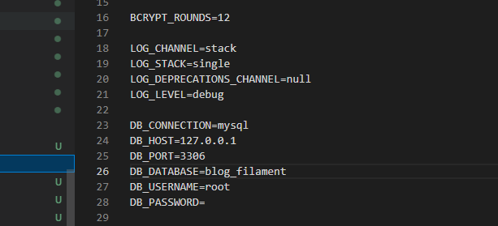
```

---

### 🔹 Step 2 — Install Filament (hasil terminal sebelumnya hilang)

```bash id="x9x6bc"
php artisan make:filament-panel admin
```

📸 Screenshot:

```md id="rq9m1s"
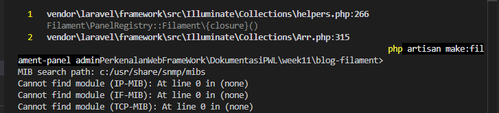
```

---

### 🔹 Step 3 — Buat User Admin

```bash id="k2p5z7"
php artisan make:filament-user
```

📸 Screenshot:

```md id="9rzqzq"
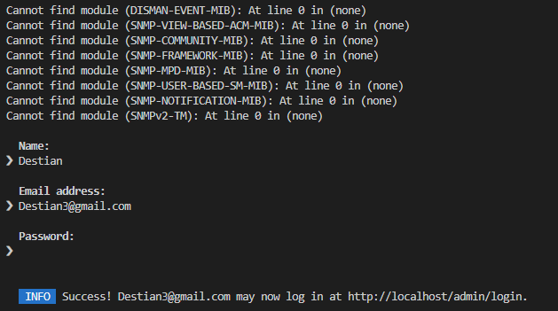
```

---

### 🔹 Step 4 — Model & Migration

```bash id="xfh43f"
php artisan make:model Category -m
php artisan make:model Post -m
```

📸 Screenshot:

```md id="zx9a2n"
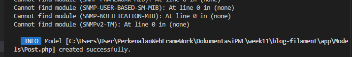
```

```md id="zx9a2n"
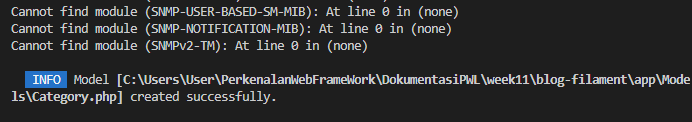
```

---

### 🔹 Step 5 — Struktur Database

**Category**

```php id="u0hj5u"
$table->string('name');
```

**Post**

```php id="v8rm7j"
$table->string('title');
$table->string('slug');
$table->foreignId('category_id')->constrained();
```

📸 Screenshot:

```md id="y4u7h0"
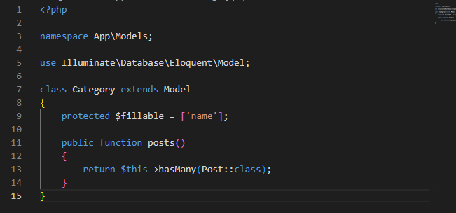
```

```md id="y4u7h0"
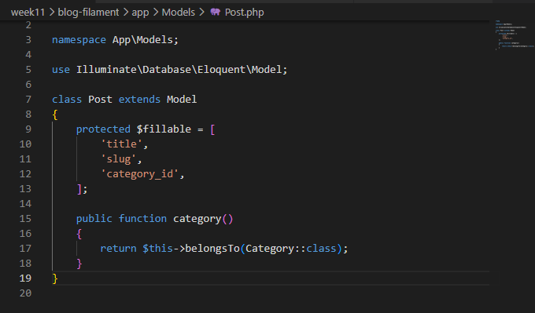
```

---

### 🔹 Step 6 — Jalankan Migration

```bash id="n9avhj"
php artisan migrate
```

📸 Screenshot:

```md id="mzqkzj"
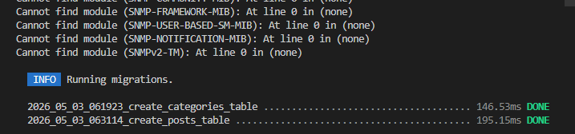
```

---

### 🔹 Step 7 — Resource Filament

```bash id="w8tkdp"
php artisan make:filament-resource Category
php artisan make:filament-resource Post
```

📸 Screenshot:

```md id="4s8c9k"
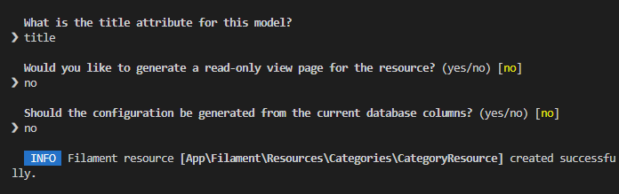
```

```md id="4s8c9k"

```

---

### 🔹 Step 8 — Hasil

📸 Screenshot:

```md id="4c4zfp"
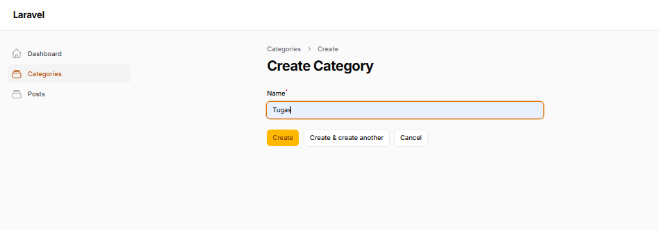
```

```md id="a9u4l9"
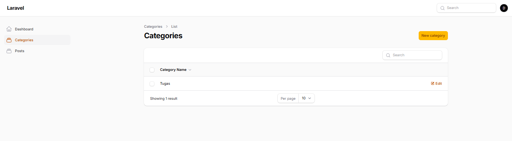
```

```md id="a9u4l9"
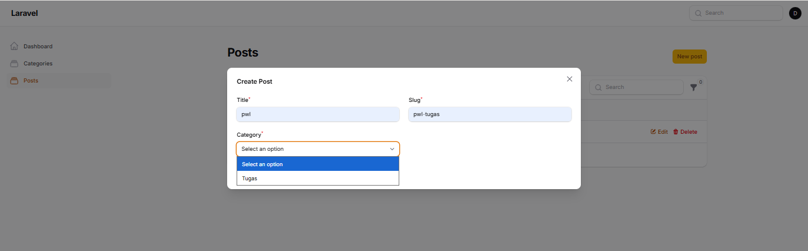
```

```md id="a9u4l9"
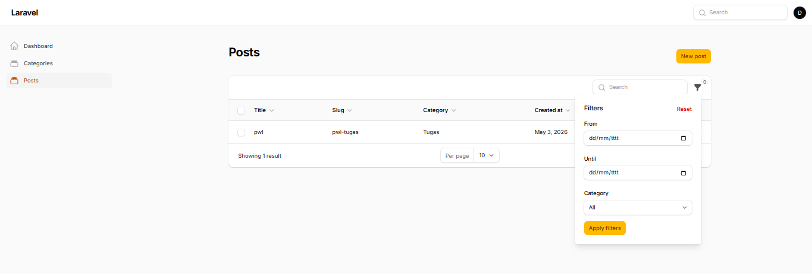
```

---
